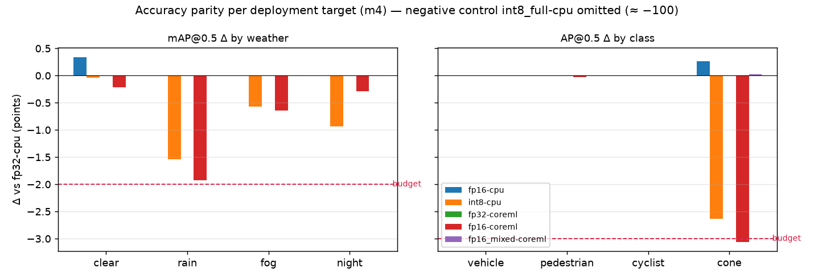
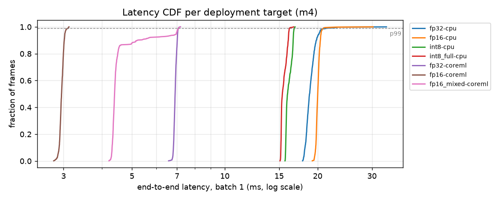
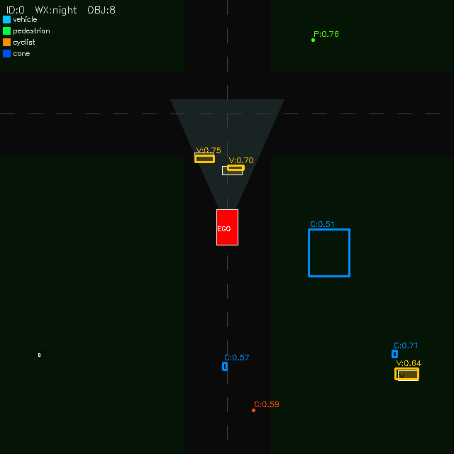
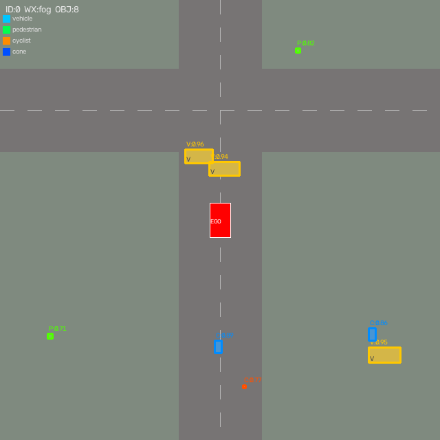
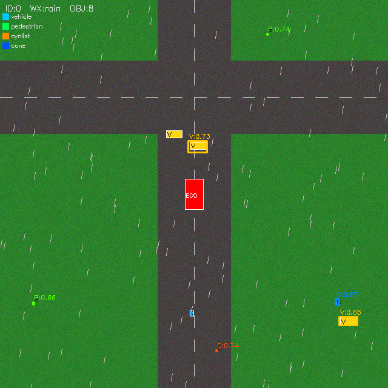

# NuroSim-Lite 🚗

> **AV perception model deployment & inference validation** — train a detector on
> synthetic driving scenes, convert it to FP16 / INT8 for several execution
> providers, prove each deployed variant still behaves like the trained model
> (per class, per weather condition), measure tail latency, and block the release
> in CI when a variant breaks its accuracy or latency budget.

[](https://github.com/sreeram-revoori/NuroSim-Lite/actions/workflows/ci.yml)
[](https://www.python.org/)
[](https://onnxruntime.ai/)

---

## The pipeline

```
 synthetic BEV scenarios          python -m nurosim.deploy …
 (4 weathers, 4 classes)
          │
          ▼
   ┌─────────────┐   ┌──────────────┐   ┌──────────────────────────────────────────┐
   │ train       │──▶│ export       │──▶│ quantize                                 │
   │ YOLOv8n     │   │ ONNX FP32    │   │  fp16 · fp16_mixed · int8 · int8_full    │
   │ (MPS/CUDA)  │   │ (committed)  │   │  (INT8 = QDQ, weather-stratified calib.) │
   └─────────────┘   └──────────────┘   └──────────────────┬───────────────────────┘
                                                           │  × execution providers
                                                           ▼  (CPU · CoreML · CUDA · TensorRT)
   ┌──────────────────────────────┐   ┌──────────────────────────┐   ┌──────────────────────┐
   │ parity                       │   │ bench                    │   │ gate                 │
   │ vs FP32 reference, 300 held- │   │ batch-1 e2e p50/p99/max, │   │ accuracy + latency   │
   │ out scenes: mAP per class &  │──▶│ pre/infer/post split,    │──▶│ budgets, EP actually │
   │ weather, detection agreement,│   │ cold start, batch sweep  │   │ active, reports fresh│
   │ raw-tensor error             │   │                          │   │ → exit 1 on failure  │
   └──────────────────────────────┘   └──────────────────────────┘   └──────────────────────┘
```

A **target** is *(model variant, execution provider, provider options)* — e.g.
`int8` on the CPU EP, or `fp16_mixed` on CoreML. Targets are grouped into
hardware **profiles** in [`configs/deploy.yaml`](configs/deploy.yaml): `m4`,
`ci-cpu` (GitHub runners) and `nvidia-trt`.

---

## Results — Apple M4

Model: YOLOv8n trained from scratch on 3,000 synthetic frames ([model card](models/README.md)).
Accuracy on **300 held-out scenarios**, reference = FP32 on the CPU EP.

<!-- RESULTS:START -->
| target | EP | size | mAP@0.5 | mAP@.5:.95 | cone AP@0.5 | worst weather Δ | e2e p50 / p99 (ms) | gate |
|---|---|---|---|---|---|---|---|---|
| `fp32-cpu` | CPU | 12.2 MB | **0.965** | **0.854** | **0.910** | — | 18.8 / 21.4 | ✅ pass |
| `fp16-cpu` | CPU | 6.2 MB | 0.966 (+0.001) | 0.849 (-0.005) | 0.913 (+0.003) | rain ±0.000 | 20.0 / 20.9 | ✅ pass |
| `int8-cpu` | CPU | 3.5 MB | 0.959 (-0.007) | 0.810 (-0.044) | 0.884 (-0.026) | rain -0.015 | 16.0 / 16.8 | ✅ pass |
| `int8_full-cpu` | CPU | 3.4 MB | 0.000 (-0.965) | 0.000 (-0.854) | 0.000 (-0.910) | clear -0.971 | 15.4 / 16.2 | ✅ caught (negative control) |
| `fp32-coreml` | CoreML | 12.2 MB | 0.965 (±0.000) | 0.854 (±0.000) | 0.910 (±0.000) | clear ±0.000 | 6.9 / 7.1 | ✅ pass |
| `fp16-coreml` | CoreML | 6.2 MB | 0.957 (-0.008) | 0.830 (-0.024) | 0.879 (-0.031) | rain -0.019 | 3.0 / 3.1 | ❌ worst class drop |
| `fp16_mixed-coreml` | CoreML | 6.2 MB | 0.965 (±0.000) | 0.853 (±0.000) | 0.910 (±0.000) | night ±0.000 | 4.4 / 7.1 | ✅ pass |

Latency: end-to-end batch 1 (preprocess + inference + decode/NMS), 3 independent sessions × 200 frames, CPU EP pinned to 4 performance cores; onnxruntime 1.30.0, macOS 26.6.2. Gate verdict for the profile: **❌ FAIL** — it blocks `fp16-coreml` (see finding 2).





Full reports: [parity](reports/parity_m4.md) (per-class / per-weather tables, detection- and tensor-level parity) · [benchmark](reports/benchmark_m4.md) (stage split, cold start, batch sweep) · [gate](reports/gate_m4.md)

<p align="center">  </p>
<p align="center"><sub>INT8 model on held-out night / fog / rain scenes — dashed white = ground truth, coloured = detections.</sub></p>
<!-- RESULTS:END -->

---

## What the harness found

**1. Naive full-INT8 zeroes every detection.** YOLOv8's head ends in a `Concat` of
box coordinates (0–640 px) and class probabilities (0–1). Quantised with one
per-tensor scale, the output `DequantizeLinear` gets scale **5.16**: any
probability below ~2.6 rounds to 0, so the model emits nothing (mAP 0.965 → 0.000).
Keeping the 24-node decode tail (DFL softmax, box arithmetic, sigmoid, concat) in
FP32 recovers it: −0.7 pts mAP@0.5 at 3.5 MB vs 12.2 MB. `int8_full` stays in
every profile as a *negative control* — the gate must keep catching it.

**2. Same FP16 file, different accuracy per backend.** FP16 on the CPU EP is lossless,
but FP16 through CoreML (Neural Engine) loses **3.1 pts AP on cones** while aggregate
mAP moves only 0.8 — the gate's per-class budget blocks it; an aggregate-mAP gate
would have shipped it. Cause: the decode tail outputs pixel coordinates, and FP16
resolution is 0.5 px above 512 — real IoU for a 4–5 px cone (box max-error 0.46 px
vs 0.25 px on CPU). `fp16_mixed` (tail in FP32) restores FP32 accuracy exactly
(box MAE 0.071 → 0.004 px) for ~1.4 ms and a worse tail, since those nodes fall
back to CPU and every frame crosses ANE ↔ CPU.

**3. INT8 hurts small objects and localisation first.** With the tail fixed, INT8's
cost concentrates in cones (−2.6 AP) and rain (−1.5), and mAP@0.5:0.95 drops 4.4 pts
while mAP@0.5 drops 0.7 — box precision degrades before recall does. The current
budget gates mAP@0.5 only; mAP@0.5:0.95 is the next thing I'd add.

**4. On M4 the FP32 CPU fast path only exists at batch 1.** ORT 1.30 runs FP32 conv on
Arm KleidiAI SME kernels: 16 ms at batch 1 vs 55 ms with `mlas.disable_kleidiai=1`.
At batch ≥ 2 it falls back to a slower path — batch 2 takes ~130 ms, so batching
*lowers* FP32 throughput. INT8 doesn't use those kernels and scales linearly.
Benchmark the shapes you'll actually run. (`scripts/cpu_batch_scaling.py`)

**5. Fewer threads → faster and steadier on heterogeneous cores.** ORT's default pool
spans all 10 cores; the 6 efficiency cores straggle. Pinning to the 4 performance
cores cut INT8 p50 ~20% and narrowed run-to-run FP32 p99 from 26–42 ms to 25–31 ms.
Separately, FP32 CPU latency was sometimes *bimodal between sessions* (≈17 vs ≈30 ms
p50) while stable within a session. I haven't pinned down the cause — thread placement
on P vs E cores is the suspect, and macOS offers no hard CPU affinity — so the benchmark
now runs 3 independent sessions per target and reports each session's p50.

**6. Tooling bugs worth knowing.** (a) ORT 1.30's MinMax calibrator, given
`CalibMaxIntermediateOutputs`, *discards* each flushed chunk instead of merging it —
you'd ship INT8 scales fitted to the last few frames. Calibration here uses the
strided path, which merges. (b) The ORT FP16 converter with a node block-list
emits duplicate `Cast` nodes (invalid graph); `quantize.py` dedupes them.

---

## Benchmark methodology

* **Cold start reported separately** — session/engine build + first inference is what
  the vehicle pays at boot (CoreML compiles for ~0.5 s; TensorRT engines are cached via
  `trt_engine_cache_enable`).
* **Warmup discarded**, then 300 measured batch-1 frames from a rotating set of 64
  distinct scenes (NMS cost depends on the scene).
* **End-to-end, split by stage** — preprocess / inference / postprocess. A 1.4 ms
  engine behind 1.5 ms of Python preprocessing is a 3 ms perception stage.
* **Tail-focused** — p99, max and jitter (p99 − p50); the planner consumes the worst frame.
* **Synchronous timing** — outputs land in host memory, so ORT's `run()` is synchronous
  and wall-clock timing is valid on GPU EPs too (with IO binding you must sync first).
* **Accuracy and latency use different thresholds on purpose** — mAP at conf 0.01 (full PR
  curve), latency at the deployment operating point (conf 0.25), since NMS cost scales
  with candidate count.
* **Several sessions, not one** — 3 independent sessions per target, samples pooled,
  per-session p50s reported, because a single session can land in either latency mode.
* **Laptop caveat** — single-machine numbers vary run to run (thermals, battery, background
  load; one run in this repo's history was throttled by a near-empty battery). Real latency gating needs pinned, dedicated hardware; the CI profile's latency
  budget is only a tripwire for order-of-magnitude regressions.

---

## The release gate

`python -m nurosim.deploy gate --profile <p>` exits non-zero unless, for every target:

| check | meaning |
|---|---|
| `provider` | the requested EP actually ran — catches silent CPU fallback when an accelerator EP fails to load |
| `freshness` | report hashes match the model files on disk — no stale reports |
| `mAP@0.5 drop` | ≤ 0.01 vs reference |
| `worst weather drop` | ≤ 0.02 for every weather condition |
| `worst class drop` | ≤ 0.03 for every class |
| `e2e p99 latency` | ≤ the target's `p99_budget_ms` |
| `negative control caught` | targets marked `expect_fail` must exceed the accuracy budget |

Budgets were fixed before the first measurement. In CI ([`ci.yml`](.github/workflows/ci.yml))
the `deploy-gate` job rebuilds every variant from the committed FP32 model and runs
the `ci-cpu` profile on each push/PR; the gate table lands in the job summary.

---

## Quick start

```bash
pip install -r requirements.txt                     # inference + deploy pipeline (no torch)
make cpp-test                                       # C++ host library + tests (no CUDA)

make deploy PROFILE=m4                              # quantize → parity → bench → gate
make ci-gate                                        # what CI runs
python main.py --model models/nurosim_det_int8.onnx # original eval pipeline, real model
python scripts/cpu_batch_scaling.py                 # finding #4

# retrain from scratch (needs torch + ultralytics)
pip install -r requirements-train.txt
make dataset train export
```

### NVIDIA / TensorRT (Tier 2)

[`gpu/`](gpu/README.md) adds a C++ TensorRT pipeline and one script that runs every
GPU experiment: a latency matrix that adds one optimisation per row (FP16, fused GPU
letterbox kernel, in-engine EfficientNMS, CUDA graphs, FP32-pinned head tail, INT8,
DLA on Orin) with CUDA-event stage timing; accuracy parity of the engines on the same
held-out scenes and budgets; a batch sweep; a two-model contention test (30 Hz detector
vs a saturating batch-8 model, with and without stream priorities); Nsight Systems
profiles; and the `nvidia-trt` ONNX Runtime profile above.

```bash
make gpu-docker-build && make gpu-docker-run     # x86 + NVIDIA GPU (TensorRT container)
bash scripts/gpu/run_all.sh                      # Jetson Orin / bare metal
```

> **Ready, not yet run.** No NVIDIA hardware was available. Host-side C++ is unit-tested
> and matches the Python decode exactly (709/709 detections); GPU sources are
> compile-checked in CI against real TensorRT headers. All GPU numbers are still to come.

---

## Fixes to the original v0.1

Writing a real inference path exposed problems in the first version of this repo:

* **The old README's latency (0.8 ms p50, ~480 scenarios/s) was not model latency.**
  It timed `MockDetector`, which jitters ground-truth boxes. The mock is still there for
  fast tests; every latency number above is a real network.
* **`ONNXDetector`** had no NMS, left boxes in 640×640 model space instead of mapping them
  back through the resize, and mapped COCO classes with `cls_id % 4`. It now wraps
  `nurosim.inference` (letterbox → ORT → vectorised decode + class-aware NMS).
* **Rain frames weren't deterministic** — rain noise used the unseeded global
  `np.random`. Parity checks need bit-identical inputs.
* **Degenerate ground truth** — at 6.4 px/m, cones rendered 0–3 px wide and some GT
  boxes had zero width. Now 10 px/m with a 4 px minimum.
* **Ray workers rebuilt the detector for every task.** They're now long-lived actors
  (`ActorPool`) that load the model once; the multiprocessing fallback does the same via
  a pool initializer, and ONNX sessions split cores between workers.
* `iou_matrix` was a Python double loop; now vectorised.

---

## Project structure

```
NuroSim-Lite/
├── nurosim/
│   ├── scenario_generator.py   # BEV frame synthesis + GT boxes
│   ├── perception_model.py     # MockDetector, ONNXDetector, TimedDetector, build_detector
│   ├── metrics.py              # IoU, mAP@0.5, mAP@0.5:0.95, per-class / per-weather
│   ├── ray_worker.py           # Ray actors / process pool, model loaded once per worker
│   ├── tracker.py              # MLflow logging + plots
│   ├── inference/              # the runtime path
│   │   ├── preprocess.py       #   letterbox (shared with INT8 calibration)
│   │   ├── postprocess.py      #   vectorised YOLOv8 decode + class-aware NMS
│   │   ├── runtime.py          #   ORT session, EP selection, fallback detection
│   │   └── detector.py         #   InferenceDetector with per-stage timing
│   └── deploy/                 # python -m nurosim.deploy …
│       ├── dataset.py, train.py, export.py
│       ├── quantize.py         #   FP16 / INT8 (QDQ), calibration reader
│       ├── parity.py           #   task-, detection- and tensor-level parity
│       ├── benchmark.py        #   latency methodology
│       ├── gate.py             #   budgets → exit code
│       └── config.py, seeds.py
├── configs/deploy.yaml         # variants, profiles, targets, budgets
├── models/                     # FP32 reference + model card
├── reports/                    # latest parity / benchmark / gate reports (M4)
├── gpu/                        # Tier 2: C++ TensorRT pipeline, CUDA kernel, tools, tests
├── scripts/
│   ├── cpu_batch_scaling.py
│   └── gpu/run_all.sh          # every GPU experiment, one command
├── tests/                      # 58 Python tests; a tiny generated ONNX model stands in for CI
├── main.py                     # original evaluation pipeline (--model for a real detector)
└── .github/workflows/ci.yml    # tests + deploy gate
```

Seeds are split so nothing leaks: train 0+, val 50,000+, held-out eval 100,000+,
INT8 calibration 200,000+, benchmark 300,000+ ([`seeds.py`](nurosim/deploy/seeds.py)).

---

## Author

**Sreeram Revoori**
M.S. Data Science — Stony Brook University
[LinkedIn](https://linkedin.com/in/sreeram-r-revoori) · [GitHub](https://github.com/sreeram-revoori) · [Email](mailto:rsreddy2104@gmail.com)
